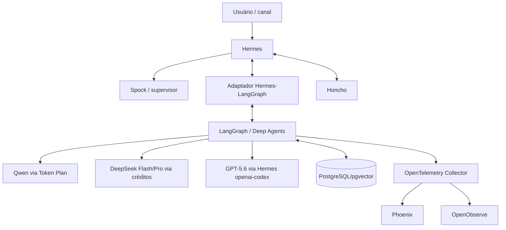
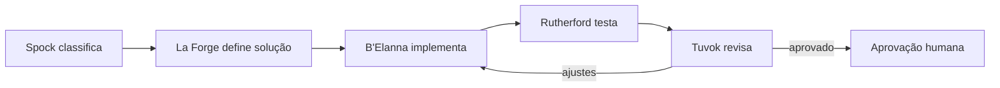

# Projeto de orquestração multiagente do homelab

Última atualização: 2026-08-12 (America/Sao_Paulo)

Status: planejamento aprovado para implementação incremental

## 1. Resumo executivo

O homelab já possui o Hermes Agent em fase de configuração, com perfis separados,
Honcho para memória e três formas de acesso a modelos:

- GPT-5.6 pelo provedor `openai-codex`, associado ao plano ChatGPT Pro;
- Qwen pelo Alibaba Token Plan, usando a API compatível com OpenAI;
- DeepSeek por API pré-paga com créditos.

A arquitetura escolhida preserva o Hermes como gateway de modelos, mensageria e
identidade dos agentes. LangGraph e Deep Agents serão adicionados para controlar
workflows, estado, delegações, aprovações, retomadas e limites. A observabilidade
inicial será feita com Phoenix self-hosted. OpenObserve entra no escopo de
implantação do homelab como piloto posterior para logs, métricas, traces,
alertas e incidentes. LangSmith permanece opcional.

A implementação não deve exigir `OPENAI_API_KEY`. Para isso, toda chamada aos
modelos GPT-5.6 deve continuar passando pelo Hermes e por `openai-codex`. Uma
integração direta entre LangGraph e a API da OpenAI mudaria o regime de cobrança
e está fora do desenho inicial.

O Hermes ainda não está em uso operacional. Portanto, modelos e papéis podem ser
reorganizados agora, sem uma migração longa ou compatibilidade produtiva.

## 2. Objetivos

- Manter o Hermes como ponto único de acesso aos provedores de modelos.
- Adicionar workflows determinísticos e retomáveis com LangGraph.
- Usar Deep Agents somente onde a delegação dinâmica trouxer benefício real.
- Preservar Honcho como memória de longo prazo e perfil do usuário.
- Usar PostgreSQL/pgvector para checkpoints, estado e recuperação semântica.
- Distribuir tarefas entre GPT-5.6, Qwen e DeepSeek por custo e capacidade.
- Criar uma equipe técnica com personagens de Star Trek.
- Não interromper os gateways Hermes durante a implantação.
- Evitar cobrança da API OpenAI na primeira versão.
- Medir custo, latência, qualidade, falhas e escalonamentos por agente.
- Avaliar OpenObserve como backend operacional unificado sem retirar Phoenix
  antes de uma comparação controlada.

## 3. Fora do escopo inicial

- Desligar ou substituir o Hermes.
- Migrar as memórias do Honcho para LangGraph.
- Expor PostgreSQL, Redis ou APIs internas diretamente à internet.
- Permitir deploy em produção sem aprovação humana.
- Permitir que agentes manipulem segredos livremente.
- Executar todos os agentes em paralelo para toda tarefa.
- Contratar LangSmith antes de validar a necessidade.
- Configurar uma chave da API OpenAI somente para viabilizar a orquestração.
- Substituir Phoenix por OpenObserve sem piloto, critérios e rollback.
- Implantar OpenObserve em HA, Kubernetes, NATS ou object storage antes de
  comprovar a necessidade no modo single-node.

## 4. Estado atual do homelab

| Serviço/container | Função | Observação |
|---|---|---|
| Kopia | Backup | Interface publicada nas interfaces locais autorizadas |
| Homepage | Portal do homelab | Saudável; receberá atalhos operacionais |
| Hermes | Execução dos agentes | Instalado no Linux; perfis usam containers auxiliares |
| Honcho API | Memória do usuário | API vinculada ao PostgreSQL/Redis |
| Honcho Deriver | Derivação de memória | Worker interno |
| PostgreSQL + pgvector | Banco do Honcho | Pode hospedar outros bancos isolados |
| Redis | Cache/fila do Honcho | Vinculado ao loopback |
| Ollama proxy | Acesso ao Ollama | Componente interno do Honcho |
| Docling | Extração de documentos | Publicado na rede local |
| Uptime Kuma | Monitoramento | Saudável |
| Portainer | Administração Docker | HTTPS publicado na rede local |
| Jellyfin | Mídia | Saudável |
| Open WebUI | Interface de modelos | Saudável |
| OpenObserve | Observabilidade operacional unificada | Planejado; ainda não implantado |

### 4.1 PostgreSQL e pgvector

A decisão é compartilhar a mesma **instância PostgreSQL**, mas não o mesmo banco,
usuário ou schema do Honcho.

| Consumidor | Banco | Usuário | Extensões |
|---|---|---|---|
| Honcho | `honcho` | exclusivo do Honcho | `vector`, conforme necessário |
| Qualitas testes | `qualitas_test` | exclusivo do Qualitas | `vector`, se necessário |
| Orquestração | `agent_orchestrator` | exclusivo da stack | `vector`, se necessário |

Regras:

- nenhuma aplicação utiliza o usuário de outra aplicação;
- cada aplicação recebe privilégios apenas sobre o próprio banco;
- migrations usam credencial própria e controlada;
- backups do Kopia incluem volume, configuração e teste de restauração;
- pgvector é ativado individualmente em cada banco que precisar dele;
- cargas do Qualitas são monitoradas para não afetar o Honcho.

### 4.2 Administração do PostgreSQL

O acesso pelo DBeaver no MacBook e a inclusão do pgAdmin na Homepage são
desejáveis, respeitando estas condições:

- preferir Tailscale ou túnel SSH;
- não publicar a porta 5432 em `0.0.0.0`;
- usar TLS quando o acesso não ocorrer exclusivamente por túnel;
- criar usuário administrativo nominal e separado dos usuários das aplicações;
- proteger pgAdmin com senha própria e, futuramente, proxy autenticado;
- não armazenar senhas no repositório ou neste documento.

## 5. Arquitetura escolhida

### 5.1 Comparação

| Critério | Somente Hermes | Migração completa | Arquitetura híbrida |
|---|---:|---:|---:|
| Continuidade operacional | Alta | Baixa | Alta |
| Controle de workflows | Médio | Alto | Alto |
| Controle de custos | Alto | Baixo/médio | Alto |
| Observabilidade | Baixa/média | Alta | Alta |
| Reaproveitamento dos agentes | Alto | Baixo | Alto |
| Facilidade de rollback | Alta | Baixa | Alta |
| Adequação ao homelab | Boa | Excessiva inicialmente | Muito boa |

Decisão: adotar a arquitetura híbrida.

### 5.2 Componentes

| Componente | Responsabilidade |
|---|---|
| Hermes | Gateway de modelos, perfis, credenciais, mensageria e entrada |
| LangGraph | Grafo, estado, checkpoints, retry, interrupções e aprovações |
| Deep Agents | Delegação dinâmica quando subagentes trouxerem benefício real |
| Honcho | Memória de longo prazo e modelagem do usuário |
| PostgreSQL | Checkpoints, execuções, auditoria e estado relacional |
| pgvector | Recuperação semântica quando necessária |
| Phoenix | Traces, latência, tokens, erros e avaliações self-hosted |
| OpenTelemetry Collector | Redaction, roteamento, retry e fan-out de telemetria |
| OpenObserve | Logs, métricas, traces, dashboards, alertas e incidentes |
| LangSmith | Alternativa futura e opcional |

### 5.3 Fluxo



Preferencialmente, o adaptador pedirá ao Hermes a execução de um perfil. O
Hermes continuará resolvendo modelo, provedor e credencial.

## 6. Custos e credenciais

| Família | Acesso atual | Estratégia |
|---|---|---|
| GPT-5.6 | `openai-codex` com ChatGPT Pro | Sem API OpenAI direta |
| Qwen | Alibaba Token Plan | Aproveitar o plano contratado |
| DeepSeek via QwenCloud | Token Plan Individual | Rota primária dos perfis migrados; Credits e allowlist do plano |
| DeepSeek direta | API com saldo pré-pago | Reserva técnica proposta; grant humano e teto independente |
| LangGraph/Deep Agents | Local | Sem licença obrigatória |
| Phoenix | Self-hosted | Somente recursos do homelab |
| OpenObserve | Self-hosted OSS | Piloto single-node; imagem fixada; sem Enterprise inicialmente |
| LangSmith | Opcional | Não adotar inicialmente |

### 6.1 Condição para não usar API OpenAI

Não será necessária uma chave da API OpenAI se:

1. o Hermes continuar autenticado em `openai-codex`;
2. LangGraph chamar o Hermes, e não a OpenAI diretamente;
3. nenhuma biblioteca fizer fallback silencioso para a Responses API;
4. indisponibilidade de provedor gerar falha explícita;
5. os limites do ChatGPT Pro forem tratados como capacidade limitada.

`OPENAI_API_KEY` não fará parte do Compose inicial. Uma integração direta futura
exigirá decisão arquitetural e financeira separada.

### 6.2 Controles de consumo

- orçamento por workflow e provedor;
- máximo de chamadas e ciclos de correção;
- contexto mínimo por agente;
- sumarização entre etapas;
- escalonamento Flash → Pro → GPT-5.6 somente por regra;
- circuit breaker diário e mensal para DeepSeek;
- nenhum fallback financeiro silencioso; a reserva direta exige
  `reserve_required`, grant humano de uso único e budget separado;
- painel de consumo e falhas no Phoenix;
- painel operacional no OpenObserve após o piloto, sem duplicar alertas em
  produção antes da decisão de consolidação;
- nenhuma implementação duplicada sem justificativa.

## 7. Inventário completo dos perfis Hermes

Estado informado em 2026-08-10:

| Perfil | Modelo atual | Gateway | Alias | Distribuição |
|---|---|---|---|---|
| `default` | GPT-5.6 Sol | parado | — | — |
| `alfred` | GPT-5.6 Sol | rodando | `alfred` | — |
| `bashir` | GPT-5.6 Terra | parado | `bashir` | — |
| `crusher` | GPT-5.6 Sol | parado | `crusher` | — |
| `data` | Qwen 3.8 Max | parado | `data` | — |
| `la-forge` | GPT-5.6 Terra | parado | `la-forge` | — |
| `obrien` | GPT-5.6 Terra | parado | `obrien` | — |
| `seven` | GPT-5.6 Sol | parado | `seven` | — |
| `spock` | GPT-5.6 Sol | rodando | `spock` | — |
| `troi` | GPT-5.6 Terra | parado | `troi` | — |
| `tuvok` | DeepSeek V4 Pro | parado | `tuvok` | — |
| `uhura` | GPT-5.6 Luna | parado | `uhura` | — |

| Família | Perfis | Quantidade |
|---|---|---:|
| GPT-5.6 Sol | default, alfred, crusher, seven, spock | 5 |
| GPT-5.6 Terra | bashir, la-forge, obrien, troi | 4 |
| GPT-5.6 Luna | uhura | 1 |
| Qwen | data | 1 |
| DeepSeek | tuvok | 1 |

Somente Alfred e Spock estavam com gateway em execução no inventário.

## 8. Distribuição-alvo dos agentes existentes

Proposta a validar por testes; nenhuma troca está concluída antes de verificar
autenticação, tool calling e qualidade.

| Perfil | Modelo-alvo inicial | Responsabilidade |
|---|---|---|
| `default` | GPT-5.6 Luna | Fallback econômico e tarefas genéricas |
| `alfred` | GPT-5.6 Terra | Assistente pessoal e organização |
| `bashir` | GPT-5.6 Terra | Análise clínica especializada |
| `crusher` | GPT-5.6 Sol | Governança clínica e decisões críticas |
| `data` | Qwen 3.8 Max | Dados, SQL, análise e documentação estruturada |
| `la-forge` | Qwen disponível no Token Plan | Engenharia e implementação |
| `obrien` | DeepSeek V4 Flash | Docker, automação, operação e testes de infraestrutura |
| `seven` | GPT-5.6 Sol | Pesquisa e síntese complexa |
| `spock` | GPT-5.6 Sol | Supervisão, planejamento e decisão final |
| `troi` | GPT-5.6 Terra | Intenção, contexto e comunicação sensível |
| `tuvok` | DeepSeek V4 Pro | Revisão rigorosa, lógica e segurança |
| `uhura` | GPT-5.6 Luna | Comunicação, tradução e formatação |

Observações:

- temas clínicos permanecem em GPT-5.6 até existirem avaliações próprias;
- comandos de infraestrutura do O'Brien continuam sujeitos a aprovação humana;
- La Forge só migra após teste do Qwen exato disponível no Token Plan;
- `default` não deve ser usado implicitamente em produção;
- troca de modelo não altera automaticamente memória ou personalidade.

## 9. Novos agentes Star Trek

A personalidade nunca terá precedência sobre segurança e instruções técnicas.

### 9.1 Primeira leva

| Perfil | Personagem | Modelo-alvo | Especialidade |
|---|---|---|---|
| `b-elanna` | B'Elanna Torres | Qwen | Backend, APIs, integrações e refatorações |
| `barclay` | Reginald Barclay | DeepSeek V4 Flash | Reprodução de bugs e correções pequenas |
| `rutherford` | Sam Rutherford | DeepSeek V4 Flash | Testes, CI e automação |

### 9.2 Expansão condicionada

| Perfil | Personagem | Modelo-alvo | Especialidade |
|---|---|---|---|
| `wesley` | Wesley Crusher | Qwen | Protótipos e desenvolvimento geral |
| `dax` | Jadzia Dax | Qwen | Bancos, migrations e integrações |
| `scotty` | Montgomery Scott | DeepSeek V4 Pro | Incidentes complexos e recuperação |

Não criar a segunda leva antecipadamente. Cada perfil aumenta a manutenção de
prompts, permissões, avaliações e observabilidade.

```text
Spock — supervisor
├── La Forge — arquitetura e engenharia
├── Tuvok — revisão e segurança
├── Data — dados e análise
├── O'Brien — infraestrutura
└── Equipe de desenvolvimento
    ├── B'Elanna — backend e integrações
    ├── Barclay — debug
    └── Rutherford — testes e CI
```

## 10. Workflows iniciais

### 10.1 Funcionalidade



- no máximo dois ciclos automáticos de correção;
- Tuvok participa apenas em mudanças relevantes ou de risco;
- Spock não sintetiza tarefas triviais bem-sucedidas;
- deploy, migrations destrutivas e segurança exigem aprovação.

### 10.2 Bug

1. Barclay reproduz e registra a evidência.
2. La Forge ou B'Elanna define a correção.
3. Rutherford cria o teste de regressão.
4. O implementador trabalha em worktree isolado.
5. Tuvok revisa quando houver risco elevado.
6. Um humano aprova merge e ações externas.

### 10.3 Infraestrutura

1. O'Brien coleta estado somente leitura.
2. La Forge avalia impacto e rollback.
3. Rutherford valida Compose, healthchecks e testes.
4. Mudanças são apresentadas para aprovação humana.
5. O'Brien executa somente após aprovação.
6. Uptime Kuma e Phoenix verificam o resultado.

## 11. Segurança e governança

- executar agentes como usuário não root;
- tratar acesso ao socket Docker como alto privilégio;
- usar worktrees ou diretórios isolados por tarefa;
- fornecer somente ferramentas necessárias a cada agente;
- separar permissões de leitura, escrita, execução e publicação;
- nunca inserir tokens em prompts, logs ou documentação;
- exigir aprovação para exclusão, deploy, push, merge, banco e infraestrutura;
- registrar modelo, perfil, ferramentas, duração e resultado;
- impedir fallback de provedor não declarado;
- adotar timeouts, retries limitados e circuit breakers;
- manter rollback para cada mudança operacional;
- revisar retenção de traces antes de usar serviços externos.

## 12. Estrutura sugerida

```text
docker/agent-orchestrator/
├── compose.yaml
├── .env.example
├── README.md
├── pyproject.toml
├── src/orchestrator/
│   ├── api/
│   ├── adapters/hermes.py
│   ├── agents/
│   ├── graphs/
│   ├── memory/
│   ├── observability/
│   ├── policies/
│   └── settings.py
├── migrations/
├── tests/
│   ├── unit/
│   ├── integration/
│   └── evals/
└── docs/
    ├── architecture.md
    ├── agents.md
    └── operations.md
```

## 13. Plano de implementação

### Fase 0 — Baseline e proteção

- [x] Inventariar versões de Hermes, Honcho, PostgreSQL e Docker.
- [x] Exportar configurações não secretas dos 12 perfis.
- [x] Confirmar backup das configurações do Hermes no Kopia.
- [x] Testar restauração em diretório temporário.
- [x] Registrar portas, redes, volumes e healthchecks.
- [x] Confirmar que nenhum segredo será incluído no Git.
- [x] Definir critérios objetivos do piloto.

**Aceite:** configuração atual recuperável e baseline documentada.

**Rollback:** restaurar os arquivos de perfil e reiniciar apenas o gateway afetado.

### Fase 1 — Validar provedores

- [x] Testar Spock com GPT-5.6 Sol via `openai-codex`.
- [x] Testar um perfil Terra e Uhura com Luna.
- [x] Testar Data com o Qwen configurado no Token Plan.
- [x] Corrigir autenticação/modelo Qwen se persistirem erros 401 ou 404 históricos.
- [x] Testar Tuvok com DeepSeek V4 Pro.
- [x] Criar perfil temporário e testar DeepSeek V4 Flash.
- [x] Confirmar tool calling e respostas estruturadas por provedor.
- [x] Registrar latência, limites e erros, sem credenciais.

**Aceite:** execução bem-sucedida e reproduzível por família de modelo.

### Fase 2 — Banco da orquestração

- [x] Criar banco `agent_orchestrator`.
- [x] Criar usuário exclusivo fora do repositório.
- [x] Conceder privilégios somente sobre o banco novo.
- [x] Ativar `vector` apenas se o workflow precisar.
- [x] Definir migrations e retenção.
- [x] Adicionar o banco ao backup do Kopia.
- [x] Testar backup e restauração.

**Aceite:** migrations sem acesso aos bancos Honcho e Qualitas.

### Fase 3 — Esqueleto da stack

- [x] Criar `docker/agent-orchestrator`.
- [x] Fixar versões de Python, LangGraph e dependências.
- [x] Adicionar API interna com healthcheck.
- [x] Conectar ao banco `agent_orchestrator`.
- [x] Subir Phoenix self-hosted.
- [x] Instrumentar um workflow fictício sem modelo.
- [x] Adicionar serviços à Homepage e ao Uptime Kuma.
- [x] Documentar operação e troubleshooting.

**Aceite:** stack saudável e observável, sem acessar modelos.

**Rollback:** parar somente o Compose novo; Hermes permanece intacto.

### Fase 4 — Adaptador Hermes-LangGraph

- [x] Identificar a interface local mais estável do Hermes.
- [x] Definir `run_agent(profile, task, context, limits)`.
- [x] Normalizar texto, tool calls, erros, timeout e uso.
- [x] Correlacionar execução LangGraph e sessão Hermes.
- [x] Impedir fallback para API OpenAI.
- [x] Implementar cancelamento e timeout.
- [x] Criar testes com doubles e teste real com Spock.
- [x] Confirmar ausência de `OPENAI_API_KEY` no container.

**Aceite:** LangGraph executa Spock pelo Hermes, sem chave da API OpenAI.

### Fase 5 — Reconfigurar agentes existentes

- [x] Alterar `default` para Luna, após validação.
- [x] Avaliar Alfred em Terra.
- [x] Manter Crusher e Seven em Sol.
- [x] Manter Bashir e Troi em Terra.
- [x] Manter Data no Qwen validado.
- [x] Testar La Forge no Qwen antes da troca.
- [x] Testar O'Brien no DeepSeek Flash antes da troca.
- [x] Manter Tuvok no DeepSeek Pro.
- [x] Manter Uhura em Luna.
- [x] Executar eval curta antes/depois de cada alteração.

**Aceite:** 12 perfis respondem e mantêm suas responsabilidades.

### Fase 6 — Primeira equipe de desenvolvimento

- [x] Criar B'Elanna com Qwen.
- [x] Criar Barclay com DeepSeek Flash.
- [x] Criar Rutherford com DeepSeek Flash.
- [x] Definir SOUL, ferramentas e limites.
- [x] Restringir escrita e execução por padrão.
- [x] Criar avaliações específicas para cada papel.
- [x] Registrar perfis no adaptador e na documentação.

**Aceite:** três agentes aprovados sem sobreposição grave ou ações não autorizadas.

### Fase 7 — Primeiro workflow real

- [x] Selecionar tarefa pequena, reversível e com testes claros.
- [x] Spock classifica e La Forge define a abordagem.
- [x] B'Elanna implementa em cópia isolada (repositório ainda sem `HEAD`).
- [x] Rutherford executa testes.
- [x] Barclay investiga somente se houver falha; não foi acionado porque a suíte passou.
- [x] Tuvok revisa caso o risco justifique.
- [x] Exigir aprovação antes de commit, push ou deploy.
- [x] Registrar trace, latência, chamadas, falhas e consumo.

**Aceite:** tarefa concluída e testada, sem ação externa não aprovada.

**Evidência:** normalização do aviso inicial exato do Tirith transferida para a
árvore principal; 19/19 testes locais aprovados; Tuvok sem bloqueios; decisão final
do Spock na sessão `20260810_225549_b94581`; probe real pós-transferência
`{"phase7":"ok"}` na sessão `20260810_225655_0a7cee`. Nenhum commit, push ou
deploy foi realizado.

### Fase 8 — Piloto medido

- [x] Selecionar aproximadamente 20 tarefas representativas.
- [x] Medir conclusão e sucesso na primeira tentativa.
- [x] Medir ciclos, latência e chamadas por tarefa.
- [x] Medir Token Plan, créditos DeepSeek e limites Codex Pro.
- [x] Registrar escalonamentos para Pro/Sol.
- [x] Comparar qualidade com baseline.
- [x] Decidir se Wesley, Dax ou Scotty são necessários.

**Decisão:** GO em 2026-08-12; 20/20 concluídas, 90% na primeira
tentativa e US$ 0,0713286122 cobrados. Não há evidência de sobrecarga que
justifique adicionar Wesley, Dax ou Scotty antes da preparação operacional.

**Aceite sugerido:**

- pelo menos 80% das tarefas tecnicamente concluídas;
- 100% das ações de risco sujeitas à aprovação;
- nenhum segredo registrado;
- nenhum custo na API OpenAI;
- custo DeepSeek dentro do teto;
- rollback testado em pelo menos um cenário.

### Fase 9 — Preparação operacional

- [x] Congelar versões e gerar changelog.
- [x] Criar runbook de incidentes.
- [x] Criar alertas no Uptime Kuma para API e Phoenix.
- [x] Definir SLOs e janela de manutenção.
- [x] Revisar backups e restauração completa.
- [x] Revisar permissões Docker e filesystem.
- [x] Definir política de atualização de modelos.
- [x] Definir teto mensal DeepSeek.
- [x] Homologar aprovação humana.
- [x] Marcar a arquitetura como operacional.

### Fase 10 — Piloto OpenObserve no homelab

- [ ] Aprovar a mudança OpenSpec `deploy-openobserve-homelab`.
- [ ] Fixar uma versão estável do OpenObserve; não usar `latest`.
- [ ] Implantar inicialmente em modo single-node, com volume e identidade
  próprios e porta vinculada somente ao loopback.
- [ ] Inserir OpenTelemetry Collector entre produtores e backends.
- [ ] Fazer fan-out controlado de traces para Phoenix e OpenObserve.
- [ ] Ingerir gradualmente logs da API, Hermes e Docker e métricas do host e
  PostgreSQL.
- [ ] Aplicar redaction antes da ingestão de chaves, DSNs, prompts e dados
  pessoais ou clínicos.
- [ ] Definir retenção curta inicial e limites de CPU, memória e disco.
- [ ] Criar dashboards para chamadas, erros, latência, tokens, custo e estados
  `budget_blocked`.
- [ ] Integrar healthcheck ao Uptime Kuma e link autenticado à Homepage.
- [ ] Executar backup e restauração completa do volume e configuração.
- [ ] Comparar OpenObserve e Phoenix por pelo menos uma semana de uso controlado.
- [ ] Decidir manter ambos, consolidar ou remover OpenObserve.

**Aceite:** telemetria chega aos dois backends sem segredos; retenção, backup,
restauração, healthcheck e rollback são comprovados; Phoenix permanece
disponível durante todo o piloto.

**Rollback:** remover o exportador OpenObserve do Collector, parar somente os
novos containers e preservar Phoenix e os produtores de telemetria.

## 14. Métricas do piloto

| Métrica | Pergunta |
|---|---|
| Taxa de conclusão | O workflow entrega resultados utilizáveis? |
| Sucesso na primeira tentativa | Quantas tarefas passam sem correção? |
| Ciclos de revisão | Os agentes entram em loops? |
| Latência total | A delegação compensa o tempo? |
| Chamadas por tarefa | O desenho é excessivamente conversacional? |
| Consumo por provedor | O roteamento aproveita os planos? |
| Escalonamentos | Flash/Qwen resolvem a maior parte? |
| Intervenções humanas | Onde ainda é necessária supervisão? |
| Falhas de ferramentas | Permissões e integrações estão corretas? |
| Rollbacks | As mudanças são reversíveis? |

## 15. Riscos

| Risco | Mitigação |
|---|---|
| Interface Hermes-LangGraph instável | Spike na Fase 4 e adaptador próprio |
| Limites do Codex Pro | Menos chamadas do supervisor; usar Qwen/Flash |
| Custo DeepSeek | Teto, circuit breaker e telemetria |
| Token/modelo Qwen inválido | Validar catálogo e autenticação primeiro |
| Ações perigosas | Sandbox, allowlist e aprovação humana |
| Overhead multiagente | Delegar somente por especialização real |
| Memórias conflitantes | Honcho para longo prazo; LangGraph para execução |
| PostgreSQL afetar Honcho | Bancos/usuários separados e monitoramento |
| Personagem afetar precisão | Políticas e instruções técnicas têm precedência |
| Lock-in de observabilidade | OpenTelemetry/Phoenix self-hosted |
| Vazamento de dados no OpenObserve | Redaction no Collector, allowlist de atributos e retenção curta |
| Sobrecarga do OpenObserve | Single-node com limites, ingestão gradual e medição de disco/CPU |
| Complexidade prematura de HA | Proibir HA até o piloto demonstrar requisito e capacidade operacional |

## 16. Decisões pendentes

- Interface exata usada pelo adaptador Hermes.
- Modelo Qwen exato autorizado e funcional no Token Plan.
- Limite diário e mensal de créditos DeepSeek.
- Política de retenção de traces e conversas.
- Repositório do primeiro piloto.
- Necessidade de Deep Agents no primeiro workflow.
- Porta, hostname e autenticação da API e do Phoenix.
- Momento de adicionar pgAdmin e forma de acesso pelo MacBook.
- Retenção, volume máximo e fontes iniciais do piloto OpenObserve.
- Critério objetivo para manter Phoenix após a comparação com OpenObserve.

## 17. Próximas ações

Executar as Fases 0 e 1. Nenhum componente LangGraph deve ser iniciado antes de
existir baseline recuperável e uma chamada válida em cada família de modelos.

1. Salvar e testar o backup dos perfis.
2. Testar GPT-5.6 via `openai-codex`.
3. Validar Qwen no Token Plan.
4. Validar DeepSeek V4 Pro e V4 Flash.
5. Registrar resultados neste documento.
6. Criar banco isolado da orquestração.
7. Iniciar o esqueleto LangGraph/Phoenix.

## 18. Registro de decisões

| Data | Decisão |
|---|---|
| 2026-08-10 | Manter Hermes como mensageria e gateway de modelos |
| 2026-08-10 | Adotar LangGraph para workflows e estado |
| 2026-08-10 | Usar Deep Agents apenas quando houver delegação dinâmica |
| 2026-08-10 | Manter Honcho como memória de longo prazo |
| 2026-08-10 | Compartilhar PostgreSQL com bancos e usuários separados |
| 2026-08-10 | Não usar chave da API OpenAI inicialmente |
| 2026-08-10 | Usar Qwen Token Plan e créditos DeepSeek para desenvolvimento |
| 2026-08-10 | Preferir Phoenix self-hosted; LangSmith fica opcional |
| 2026-08-10 | Reconfigurar agora, pois Hermes não está operacional |
| 2026-08-10 | Novos agentes serão personagens de Star Trek |
| 2026-08-10 | Criar inicialmente B'Elanna, Barclay e Rutherford |
| 2026-08-10 | Usar repositório Kopia local criptografado para o baseline do Hermes |
| 2026-08-10 | Usar o Token Plan pelo perfil Hermes `data`, não por Qwen OAuth |
| 2026-08-11 | Limitar o consumo DeepSeek a US$ 1,00 por dia durante o piloto |
| 2026-08-11 | Limitar o consumo DeepSeek a US$ 10,00 no total do piloto |
| 2026-08-12 | Incluir OpenObserve no escopo futuro do homelab como piloto single-node em paralelo ao Phoenix |


### 18.1 Alibaba Token Plan

- endpoint OpenAI-compatible: `https://token-plan.ap-southeast-1.maas.aliyuncs.com/compatible-mode/v1`;
- provedor interno do Hermes: `alibaba-coding-plan` (nome legado do adaptador);
- credencial dedicada armazenada no pool de autenticação do Hermes;
- Qwen OAuth/CLI não é necessário para esse fluxo;
- o plano é restrito a uso interativo em ferramentas de programação e agentes;
- LangGraph não chamará o endpoint como backend genérico ou automação em lote:
  tarefas Qwen serão executadas pelo perfil Hermes `data`, respeitando os termos
  e as cotas do Token Plan.
